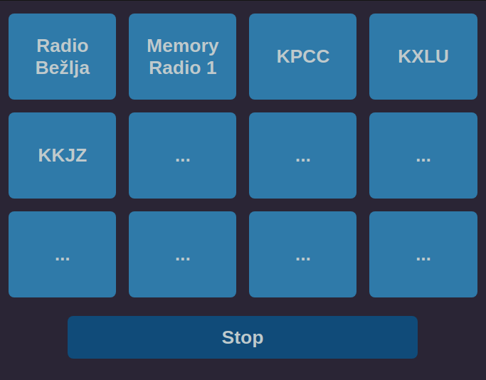

# My Blu Radio

This is a custom audio stream selector for [BluOS](https://bluos.net/) sound player devices.

The BluOS Android app doesn't seem to have an option to make a custom list of Internet radio stations (or I haven't looked thoroughly). However, the BluOS API supports arbitrary audio stream playback.

Tested on NAD Electronics C368 with MDC BluOS-2i MDC optional module.

## config.json Setup

Load your BluOS player IP address in config.json. Most devices manufactured by NAD use port 11000.

Load your station labels and URIs.

## Usage

Copy the files to a local storage. Load MyBluRadio.html in a browser.
